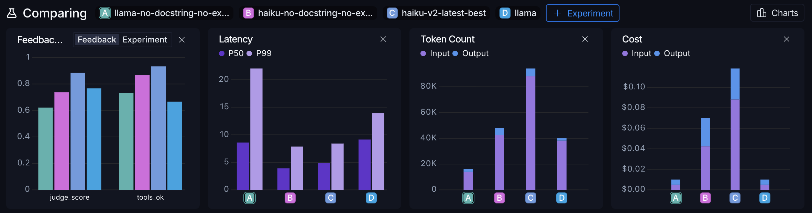

# Air Quality Agent — Paris IDF

A conversational agent that monitors air quality in Paris, detects anomalies, 
and explains their meteorological causes using real-time and historical data.

## Architecture

```
Open-Meteo AQI API ──┐
                      ├──► ingestion.py ──► snapshot.csv (optional) ──► tools (×4) ──► LangGraph agent
Open-Meteo Archive ───┘                                                      Claude Haiku
```                                             

**Stack**: LangGraph · Claude Haiku · Open-Meteo · LangSmith · Python 3.12 · uv

## Tools

| Tool | Description |
|------|-------------|
| `detect_anomaly` | Detects AQI anomalies on a given date using z-scores |
| `get_weather_context` | Returns meteorological conditions to explain anomalies |
| `get_current_data` | Returns latest available air quality measurements |
| `summarize_situation` | Summarizes anomaly count over the last N days |

## Quickstart

```bash
git clone https://github.com/sarhakim/air-quality-agent
cd air-quality-agent
uv sync
cp .env.example .env
uv run main.py
```

## Evaluation

### Dataset

15 hand-built test cases covering anomaly detection (Saharan dust, PM10, ozone), 
current conditions, out-of-range dates, weather context, and multilingual questions (FR/EN).
Evaluated with Claude Haiku as LLM-as-judge, tracked via LangSmith.


### Results
 
4 experiments — varying model (Haiku vs Llama 3.1 8B) and prompt engineering (with/without detailed docstrings and few-shot examples):
 
| Experiment | Tools OK | Judge Score | Latency P50 | Cost (15 cases) |
|---|---|---|---|---|
| Llama 3.1 8B — baseline | 73% | 0.62 | 8.6s | $0 |
| Llama 3.1 8B — docstrings + examples | 67% | 0.77 | 9.1s | $0 |
| Claude Haiku — baseline | 87% | 0.74 | 3.9s | $0.07 |
| Claude Haiku — docstrings + examples | 93% | **0.88** | 4.9s | $0.12 |

 


Results tracked on [LangSmith](https://smith.langchain.com/o/a3d7dfbe-9c58-48f5-9dbf-62937abd2574/datasets/34458ffc-a1e9-414c-a0b3-dd6ed0a60676).
 
### Key findings
 
- **Detailed tool docstrings + few-shot examples improve Haiku significantly** (+19% judge score, +6% tools_ok) but cost increase (+70%)
- **The same prompt engineering helps Llama on score** (+24%) but not on tool routing (-6%) — Llama 3.1 8B fails multi-step tool calling, writing tool calls as text instead of executing them
- **Haiku baseline already outperforms Llama with full prompt engineering** on tool routing (87% vs 67%)
- **Haiku with full prompt engineering is the best configuration** across all metrics except cost


## Known Limitations
 
- **Spatial resolution**: Open-Meteo CAMS model at ~11km resolution — no arrondissement-level granularity (AirParif API would be needed)
- **Static snapshot**: data covers Feb–May 2026; regenerate snapshot for newer data
- **Ozone detection**: daily AQI threshold misses hourly O3 peaks — `max_day` is reported but not used for anomaly classification
- **Model dependency**: multi-step tool calling requires Claude Haiku or better — Llama 3.1 8B fails on sequential tool calls

## Data Sources
 
- [Open-Meteo Air Quality API](https://open-meteo.com/en/docs/air-quality-api) — CAMS European model (PM2.5, NO2, O3, dust, European AQI)
- [Open-Meteo Archive API](https://open-meteo.com/en/docs/historical-weather-api) — Historical weather (temperature, wind, precipitation, humidity)